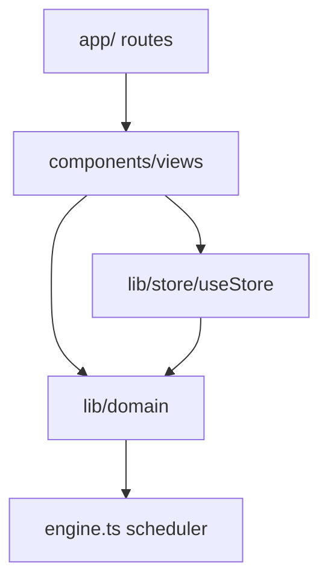

# Patrones del sistema

## Arquitectura

## Rutas principales
- `/` Inicio
- `/plan`, `/plan/nueva`, `/plan/[id]/*`
- `/tablero`, `/indicadores`, `/historico`
- `/configuracion`, `/operarios`, `/tanques`
- `/operario/[jornadaId]/[operarioId]` fullscreen

## Design system
- Tema claro minimalista: tokens HSL en `app/globals.css` (`--background`, `--primary`, etc.)
- Fuente: **Inter** (única)
- Iconos: **lucide-react**
- Primitivos shadcn-style: `components/ui/{button,badge,card,input,tabs}.tsx`
- Utilidades compartidas: `components/ui.tsx`, `lib/utils.ts` (`cn`)
- Layout: `AppShell` (header compacto + bottom nav), `PlanTabs`, `PageHeader`
- Clases legacy `.btn`, `.card`, `.field-input` en globals para vistas existentes

## Motor (`lib/domain/engine.ts`)
- Scheduler por eventos: **un candidato por iteración**; actualiza `opFreeAt`/`tankFreeAt` antes del siguiente.
- **Invariante:** un operario no tiene dos tareas manuales solapadas. Paralelismo solo con operarios/tanques distintos libres.
- Operario: earliest start → earliest finish (eficiencia) → menor carga.
- Prioridad de lote: a igual inicio, avanzar lotes ya en curso antes de abrir nuevos.
- Esperas pasivas (`tipo: pasivo`) bloquean tanque, no operario (operarios pueden pesar/montar otros).
- `compararOperarios(N)` usa snapshot completo (no solo los del plan).
- Defaults: eficiencia 100% (tiempos estándar). Bajarla alarga tareas y desfasá arranques paralelos.
- Tests: `lib/domain/engine.test.ts` (`npm test`).

## Agent guardrails
- `AGENTS.md`, `.cursor/rules/`, `.cursor/skills/change-scheduler`, `.cursor/skills/verify-scheduling`.

## Estado
- Zustand + persist localStorage.
- Estados plan: `borrador` | `aprobada` | `cerrada`.
- `simClockMin` en jornada para demo.
